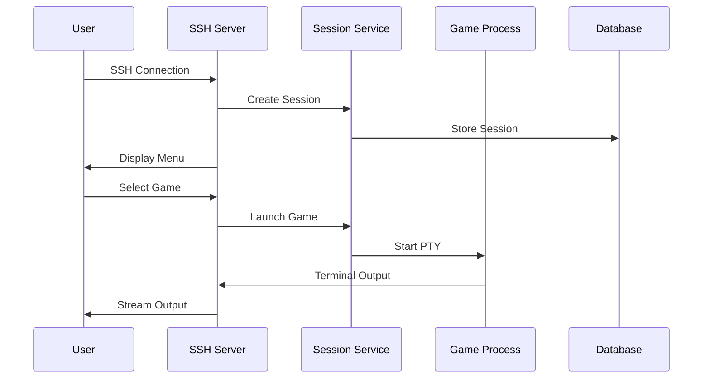
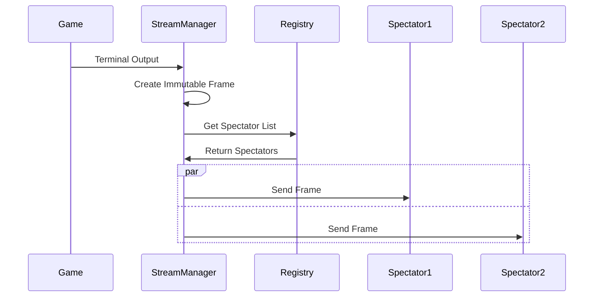

# DungeonGate Architecture

This document outlines the high-level architecture of the DungeonGate platform, focusing on the microservices design and key implementation patterns.

## 🏗️ System Overview

DungeonGate is a microservices-based platform for hosting terminal games, built with modern Go patterns and designed for scalability.

```
┌─────────────────────────────────────────────────────────────────┐
│                       DungeonGate Platform                      │
├─────────────────────────────────────────────────────────────────┤
│  ┌─────────────┐  ┌─────────────┐  ┌─────────────────────────┐  │
│  │   Client    │  │   Gateway   │  │      Microservices      │  │
│  │             │  │             │  │                         │  │
│  │ • SSH       │→→│ • Session   │→→│ • Session Service ✅    │  │
│  │ • Terminal  │  │   Service   │  │ • User Service ✅       │  │
│  │             │  │ • Load      │  │ • Auth Service ✅       │  │
│  │             │  │   Balancer  │  │ • Game Service 📋       │  │
│  └─────────────┘  └─────────────┘  └─────────────────────────┘  │
└─────────────────────────────────────────────────────────────────┘
│                                                                 │
├─────────────────────────────────────────────────────────────────┤
│  ┌─────────────┐  ┌─────────────┐  ┌─────────────────────────┐  │
│  │  Database   │  │   Storage   │  │      Infrastructure     │  │
│  │             │  │             │  │                         │  │
│  │ • SQLite    │  │ • TTY Rec   │  │ • Kubernetes            │  │
│  │ • PostgreSQL│  │ • Save Data │  │ • Monitoring            │  │
│  │ • Redis     │  │ • Logs      │  │ • Load Balancing        │  │
│  └─────────────┘  └─────────────┘  └─────────────────────────┘  │
└─────────────────────────────────────────────────────────────────┘
```

## 🎯 Core Services

### Session Service (Primary Implementation)

The session service is the main entry point for users, handling SSH connections and game sessions.

**Key Components:**
- **SSH Server**: Full SSH-2.0 protocol implementation
- **Connection Handler**: Manages SSH connections and user sessions
- **Game Client**: gRPC client for Game Service integration
- **Menu System**: User interface for game selection and spectating

**Architecture Patterns:**
- **Stateless Design**: Horizontally scalable connection handling
- **gRPC Integration**: Service-to-service communication with Game Service
- **Input Filtering**: Spectator input filtering at the session layer

### User Service (Implemented)

Handles user registration, authentication, and profile management.

**Features:**
- User registration flow via SSH terminal
- Database-backed user storage
- Profile management
- Authentication integration

### Auth Service (Implemented)

Centralized authentication and authorization service providing gRPC-based authentication for all services.

**Key Features:**
- JWT token management with configurable expiration
- User registration and login workflows
- Session validation and user profile management
- gRPC service communication with proper error handling
- Database integration for user storage
- Rate limiting and brute force protection (configurable)

**Architecture Patterns:**
- **gRPC Communication**: Type-safe inter-service communication
- **JWT Token Management**: Secure token generation and validation
- **Service Resilience**: Session service waits for auth service availability
- **No Fallback Design**: Centralized authentication without local fallbacks

### Game Service (Implemented)

Stateful, scalable game backend that manages game sessions, PTY processes, and the spectating system. The Game Service runs inside containers/pods and scales independently to handle multiple concurrent games.

**Key Features:**
- **PTY Management**: Pseudo-terminal allocation and game process management
- **Broadcast System**: Race-free output distribution to multiple connections
- **Spectating System**: Real-time terminal streaming with immutable data patterns
- **gRPC Streaming**: Unified streaming endpoint for players and spectators
- **Session Management**: Game session lifecycle and state management
- **Multi-game Support**: Multiple game types with adapter pattern

**Architecture Patterns:**
- **Broadcast Architecture**: Eliminates race conditions between player and spectator connections
- **Subscription System**: Dedicated channels for each connection
- **Immutable Data Sharing**: Lock-free concurrent programming for spectator management
- **Atomic Operations**: `atomic.Pointer[T]` for thread-safe registry updates
- **Stream Processing**: Buffered channel-based frame distribution
- **Copy-on-Write**: Efficient memory usage for spectator lists

**Service Integration:**
The Session Service integrates with the Game Service through gRPC streaming:

```go
// Session Service connects to Game Service for both players and spectators
func (h *Handler) handleGameIO(ctx context.Context, sessionID string) {
    // Start game session
    gameSession, err := h.gameClient.StartGameSession(ctx, req)
    
    // Connect to streaming endpoint (same for players and spectators)
    stream, err := h.gameClient.StreamGameIO(ctx)
    
    // Handle bidirectional streaming
    go h.handleStreamIO(stream, channel)
}

// Spectator connections use the same streaming infrastructure
func (h *Handler) startSpectating(ctx context.Context, sessionID string) {
    // Add spectator to session
    h.gameClient.AddSpectator(ctx, sessionID, userID, username)
    
    // Connect to same streaming endpoint
    stream, err := h.gameClient.StreamGameIO(ctx)
    
    // Input is filtered at session service level
    go h.handleSpectatingStream(stream, channel)
}
```

This unified approach eliminates race conditions and ensures consistent streaming for both players and spectators.

For detailed Game Service documentation, see [game-service.md](./game-service.md).

## 🔄 Data Flow

### SSH Connection Flow



### Spectating Data Flow



## 🏛️ Design Patterns

### Immutable Data Architecture

The spectating system demonstrates modern Go concurrency patterns:

**Core Principles:**
1. **Immutability**: Data structures are never modified in place
2. **Atomic Updates**: State changes use atomic compare-and-swap operations
3. **Copy-on-Write**: New versions created for each update
4. **Lock-Free Design**: No mutexes in hot paths

**Implementation:**
```go
// Immutable spectator registry
type SpectatorRegistry struct {
    Spectators map[string]*Spectator
    Version    uint64
}

// Atomic registry management
registry := &atomic.Pointer[SpectatorRegistry]{}
registry.Store(NewSpectatorRegistry())

// Lock-free updates
for {
    old := registry.Load()
    new := old.AddSpectator(spectator)
    if registry.CompareAndSwap(old, new) {
        break // Success
    }
    // Retry on conflict
}
```

### Microservices Communication

**gRPC Services:**
- High-performance internal communication
- Type-safe protocol buffers
- Streaming support for real-time features

**HTTP APIs:**
- REST endpoints for web integration
- Health checks and metrics
- Configuration management

### Database Abstraction

**Dual-Mode Support:**
- **Embedded**: SQLite for development and small deployments
- **External**: PostgreSQL for production with read/write separation

**Features:**
- Connection pooling and lifecycle management
- Health monitoring with automatic failover
- Query logging and performance metrics
- Migration support

## 🔧 Build and Development Architecture

### Comprehensive Build System

The project uses a sophisticated Makefile-based build system with 40+ targets organized into categories:

**Build Targets:**
- `make build` / `make build-auth` / `make build-all` - Service compilation
- `make build-debug` / `make build-race` - Specialized builds
- `make release-build` - Multi-platform release binaries

**Quality Assurance:**
- `make fmt` / `make lint` / `make vet` - Code quality checks
- `make vuln` - Security vulnerability scanning
- `make verify` - Comprehensive verification pipeline

**Testing Framework:**
- `make test` / `make test-coverage` - Basic and coverage testing
- `make test-ssh` / `make test-auth` / `make test-spectating` - Component-specific tests
- `make test-comprehensive` - Full test suite execution
- `make benchmark` / `make benchmark-ssh` - Performance testing

**Development Environment:**
- `make dev` - Auto-reloading development server
- `make test-run` / `make test-run-all` - Test environment management
- `make deps` / `make deps-tools` - Dependency management

**Docker Integration:**
- `make docker-build-all` - Multi-service containerization
- `make docker-compose-up` / `make docker-compose-dev` - Environment orchestration
- `make docker-test` - Container testing

### Development Tools Integration

**Static Analysis:**
- `golangci-lint` - Comprehensive Go linting
- `govulncheck` - Security vulnerability scanning
- `air` - Live reload for development

**Testing Infrastructure:**
- Specialized test suites for each major component
- Performance benchmarking with scaling analysis
- SSH connection testing and server monitoring
- Database migration and management tools

## 🔧 Configuration Architecture

### Environment-Specific Configs

```yaml
# Development
database:
  mode: "embedded"
  type: "sqlite"
  embedded:
    path: "./data/sqlite/dungeongate-dev.db"

# Production  
database:
  mode: "external"
  type: "postgresql"
  external:
    writer_endpoint: "postgres-writer:5432"
    reader_endpoint: "postgres-reader:5432"
```

### Configuration Validation

- **Schema Validation**: YAML structure validation
- **Environment Variables**: Secure secret injection
- **Default Values**: Comprehensive fallback configuration
- **Hot Reloading**: Runtime configuration updates (planned)

## 🚀 Deployment Architecture

### Development Deployment

**Local Development:**
```bash
# Auto-reloading development server
make dev

# Manual service execution
make test-run-all  # Both auth and session services
make test-run      # Session service only
```

**Docker Development:**
```bash
# Development environment with docker-compose
make docker-compose-dev

# Build and test Docker images
make docker-build-all
make docker-test
```

### Production Deployment

```yaml
# Kubernetes deployment
apiVersion: apps/v1
kind: Deployment
metadata:
  name: dungeongate-session-service
spec:
  replicas: 3
  template:
    spec:
      containers:
      - name: session-service
        image: dungeongate/session-service:latest
        ports:
        - containerPort: 22    # SSH
        - containerPort: 8083  # HTTP API
        - containerPort: 9093  # gRPC
```

## 📊 Monitoring and Observability

### Metrics (Planned)

- **Service Metrics**: Request rates, response times, error rates
- **Business Metrics**: Active sessions, user registrations, game launches
- **Infrastructure Metrics**: Resource usage, database performance
- **Custom Metrics**: Spectator counts, frame processing rates

### Logging

- **Structured Logging**: JSON format with contextual fields
- **Correlation IDs**: Request tracing across services
- **Log Levels**: Configurable verbosity
- **Security Logging**: Authentication and authorization events

### Health Checks

- **Service Health**: Individual service status
- **Dependency Health**: Database, external service connectivity
- **Business Health**: Core functionality validation

## 🔒 Security Architecture

### Authentication Flow

1. **SSH Layer**: Basic SSH protocol authentication
2. **Application Layer**: Menu-driven user authentication
3. **Service Layer**: JWT token validation between services

### Security Controls

- **Rate Limiting**: Connection and request throttling
- **Brute Force Protection**: Failed attempt monitoring
- **Session Security**: Secure token generation and validation
- **Network Security**: TLS for inter-service communication
- **Input Validation**: Comprehensive request sanitization

## 🎯 Performance Characteristics

### Scalability Targets

- **Concurrent Users**: 1000+ simultaneous SSH connections
- **Session Throughput**: 10,000+ session operations per second
- **Spectator Scale**: 100+ spectators per game session
- **Database Performance**: Sub-millisecond query response times

### Optimization Strategies

- **Connection Pooling**: Efficient resource utilization
- **Async Processing**: Non-blocking I/O operations
- **Caching**: Redis for session and configuration data
- **Load Balancing**: Horizontal scaling with session affinity

## 🔄 Future Architecture Evolution

### Planned Enhancements

1. **Service Mesh**: Istio for advanced networking and security
2. **Event Sourcing**: Immutable event logs for audit and replay
3. **CQRS**: Command-Query Responsibility Segregation for read/write optimization
4. **Streaming**: Apache Kafka for real-time event processing
5. **Edge Computing**: CDN-like game session distribution

### Technology Roadmap

- **Go 1.22+**: Latest language features and performance improvements
- **gRPC-Web**: Browser-native gRPC communication
- **WebAssembly**: Client-side game logic execution
- **Container Orchestration**: Advanced Kubernetes patterns
- **Multi-Cloud**: Cloud-agnostic deployment strategies

---

This architecture provides a solid foundation for scalable, maintainable terminal gaming infrastructure while maintaining the simplicity and performance characteristics required for real-time terminal applications.