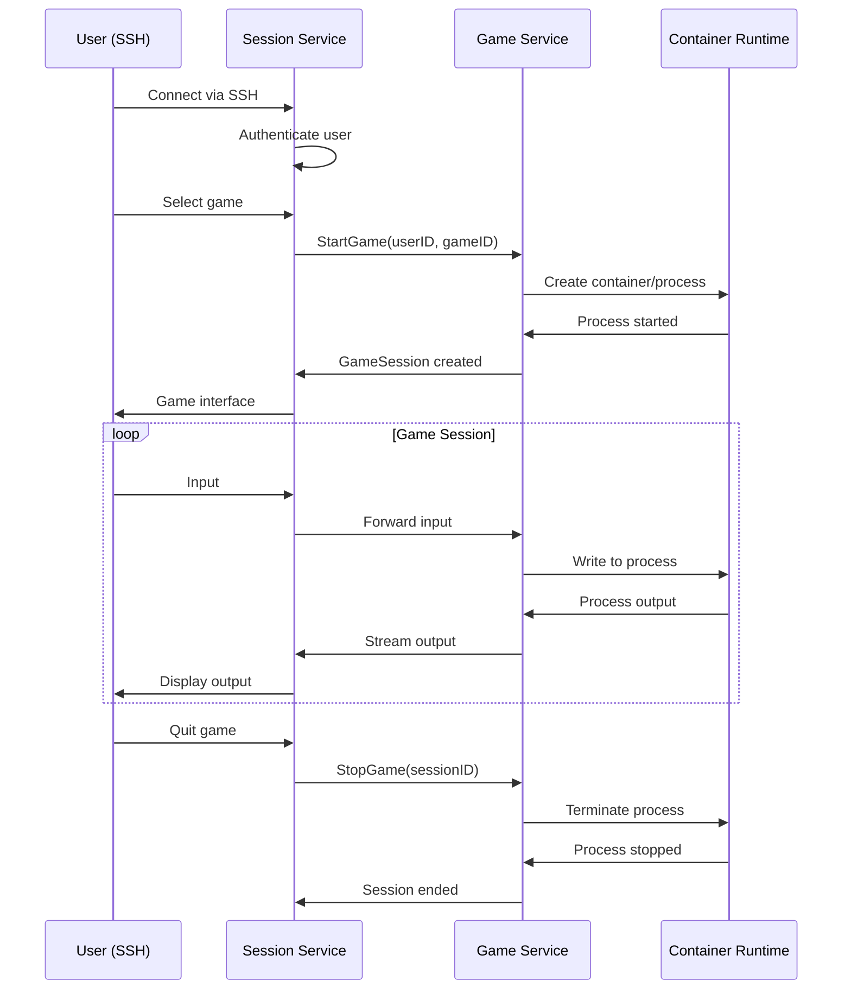

# Game Service Documentation

## Overview

The Game Service is a **stateful, scalable game backend** in the DungeonGate architecture. It runs inside containers/pods and can scale independently to handle multiple concurrent terminal-based games like NetHack, Dungeon Crawl Stone Soup, and other roguelike adventures. Each pod runs multiple games and synchronizes world state across the cluster.

## Architecture

The Game Service is a **stateful microservice** designed to run in a clustered environment with horizontal scaling:

```
┌─────────────────────────────────────────────────────────────┐
│                Game Service Cluster                        │
├─────────────────────────────────────────────────────────────┤
│  ┌───────────────┐ ┌───────────────┐ ┌───────────────┐    │
│  │  Game Pod 1   │ │  Game Pod 2   │ │  Game Pod N   │    │
│  │               │ │               │ │               │    │
│  │ ┌───────────┐ │ │ ┌───────────┐ │ │ ┌───────────┐ │    │
│  │ │ NetHack   │ │ │ │ DCSS      │ │ │ │ Multiple  │ │    │
│  │ │ Game 1    │ │ │ │ Game 1    │ │ │ │ Games     │ │    │
│  │ └───────────┘ │ │ └───────────┘ │ │ └───────────┘ │    │
│  │ ┌───────────┐ │ │ ┌───────────┐ │ │ ┌───────────┐ │    │
│  │ │ DCSS      │ │ │ │ NetHack   │ │ │ │ Save Mgmt │ │    │
│  │ │ Game 2    │ │ │ │ Game 2    │ │ │ │ World     │ │    │
│  │ └───────────┘ │ │ └───────────┘ │ │ │ Sync      │ │    │
│  └───────────────┘ └───────────────┘ └───────────────┘    │
└─────────────────────────────────────────────────────────────┘
│                           │                               │
├─────────────────────────────────────────────────────────────┤
│                  Shared World State                        │
│  ├── NetHack Bones Files (synchronized across pods)       │
│  ├── User Save Data (accessible from any pod)             │
│  ├── Shared Dungeon Levels                                │
│  └── Cross-pod Event Synchronization                      │
└─────────────────────────────────────────────────────────────┘
```

## Core Components

### 1. Game Service (`internal/games/games.go`)

The main service implementation providing:

- **Game Process Management**: Start, stop, and monitor multiple game processes per pod
- **World State Synchronization**: Sync NetHack bones files and shared world state across pods
- **User Data Management**: Handle save files accessible from any pod in the cluster
- **Load Balancing**: Distribute games across available pods based on capacity
- **Event Streaming**: Real-time game events and cross-pod state synchronization
- **Health Monitoring**: Process health checks and pod capacity monitoring

#### Key Methods

```go
func (s *Service) StartGame(ctx context.Context, req *StartGameRequest) (*GameSession, error)
func (s *Service) StopGame(ctx context.Context, sessionID string) error
func (s *Service) GetActiveGames(ctx context.Context) ([]*GameSession, error)
func (s *Service) GetGameConfig(ctx context.Context, gameID string) (*Game, error)
```

### 2. Application Layer (`internal/games/application/`)

#### Game Service Application Layer (`game_service.go`)
- High-level game operations
- Business logic orchestration
- Integration with external services

#### Session Service Application Layer (`session_service.go`)
- Session-specific game operations
- Process lifecycle management
- Resource allocation and cleanup

### 3. gRPC Client (`internal/games/client/`)

Provides client libraries for other services to interact with the Game Service:

```go
type GameServiceGRPCClient struct {
    conn   *grpc.ClientConn
    client GameServiceClient
}

func (c *GameServiceGRPCClient) StartGame(ctx context.Context, req *StartGameRequest) (*StartGameResponse, error)
func (c *GameServiceGRPCClient) StopGame(ctx context.Context, req *StopGameRequest) (*StopGameResponse, error)
func (c *GameServiceGRPCClient) GetGameSession(ctx context.Context, sessionID string) (*GameSessionResponse, error)
```

## Game Configuration

Games are configured through the main configuration system with support for:

### Game Definition

```yaml
games:
  - id: "nethack"
    name: "NetHack"
    short_name: "NH"
    enabled: true
    binary:
      path: "/usr/games/nethack"
      args: ["-u"]
      working_directory: "/tmp/nethack-saves"
    environment:
      TERM: "xterm-256color"
      HACKDIR: "/tmp/nethack-saves"
      NETHACKDIR: "/tmp/nethack-saves"
    resources:
      cpu_limit: "1.0"
      memory_limit: "256Mi"
    container:
      image: "dungeongate/nethack"
      tag: "latest"
      security_context:
        run_as_user: 1000
        run_as_group: 1000
        read_only_root_filesystem: true
```

### Pod Deployment Configuration

The Game Service is deployed as scalable pods in a cluster:

#### Development Configuration
```yaml
game_service:
  deployment:
    mode: "single-pod"
    games_per_pod: 10
    max_concurrent_games: 50
```

#### Production Configuration
```yaml
game_service:
  deployment:
    mode: "cluster"
    min_pods: 3
    max_pods: 20
    games_per_pod: 100
    auto_scaling:
      enabled: true
      cpu_threshold: 70
      memory_threshold: 80
  
  world_state:
    bones_sync_interval: "30s"
    save_sync_interval: "10s"
    shared_storage_backend: "postgresql"
```

#### Kubernetes Deployment
```yaml
game_service:
  kubernetes:
    namespace: "dungeongate-games"
    service_account: "game-service"
    horizontal_pod_autoscaler:
      min_replicas: 3
      max_replicas: 20
      target_cpu_utilization: 70
```

## Game Process Management

### Multi-Game Pod Architecture

Each Game Service pod manages multiple concurrent game processes:

- **Process Isolation**: Each game runs in separate process groups
- **Resource Allocation**: CPU and memory limits per game process  
- **Session Management**: Track active games and route player connections
- **Cleanup**: Automatic cleanup when games exit or players disconnect

### Resource Limits

```go
type ResourcesConfig struct {
    CPULimit      string `yaml:"cpu_limit"`
    MemoryLimit   string `yaml:"memory_limit"`
    DiskLimit     string `yaml:"disk_limit"`
    NetworkLimit  string `yaml:"network_limit"`
    ProcessLimit  int    `yaml:"process_limit"`
}
```

### World State Synchronization

```go
type WorldStateSynchronizer struct {
    SharedStorage    StorageBackend
    EventBus        EventBus
    SyncInterval    time.Duration
    ConflictResolver ConflictResolver
}

type BonesManager struct {
    // NetHack bones files shared across all pods
    StoreBones(gameType string, level int, bones *BonesData) error
    LoadBones(gameType string, level int) (*BonesData, error)
    SyncBones(sourcePod, targetPod string) error
    CleanupOldBones(olderThan time.Duration) error
}

type SaveManager struct {
    // User save files accessible from any pod
    SaveGame(userID int, gameType string, saveData []byte) error
    LoadGame(userID int, gameType string) ([]byte, error)
    MigrateSession(sessionID string, fromPod, toPod string) error
}
```

## Event Streaming

The Game Service provides real-time event streaming for:

### Game Events

```go
type GameEvent struct {
    EventID   string            `json:"event_id"`
    SessionID string            `json:"session_id"`
    EventType string            `json:"event_type"`
    EventData []byte            `json:"event_data"`
    Metadata  map[string]string `json:"metadata"`
    Timestamp time.Time         `json:"timestamp"`
}
```

### Event Types

- `game.started` - Game process started
- `game.stopped` - Game process stopped
- `game.crashed` - Game process crashed (future)
- `game.paused` - Game process paused
- `game.resumed` - Game process resumed
- `player.joined` - Player joined game
- `player.left` - Player left game

### Event Streaming API

```go
func (s *Service) PublishGameEvent(event *GameEvent)
func (s *Service) AddEventStream(sessionID string, stream chan *GameEvent)
func (s *Service) RemoveEventStream(sessionID string, stream chan *GameEvent)
```

## Integration with Session Service

The Game Service integrates closely with the Session Service through:

### Adapter Pattern

The Session Service uses an adapter to communicate with the Game Service:

```go
type gameClientAdapter struct {
    realClient *client.GameServiceGRPCClient
}

func NewGameServiceClient(address string) GameServiceClient {
    realClient, err := client.NewGameServiceGRPCClient(address)
    // ...
    return &gameClientAdapter{realClient: realClient}
}
```

### Service Communication



## API Reference

### gRPC Service Definition

```protobuf
service GameService {
    rpc StartGame(StartGameRequest) returns (StartGameResponse);
    rpc StopGame(StopGameRequest) returns (StopGameResponse);
    rpc GetGameSession(GetGameSessionRequest) returns (GetGameSessionResponse);
    rpc ListActiveGames(ListActiveGamesRequest) returns (ListActiveGamesResponse);
    rpc HealthCheck(HealthCheckRequest) returns (HealthCheckResponse);
}
```

### HTTP Endpoints

- `GET /health` - Health check
- `GET /games` - List available games (future)
- `GET /sessions` - List active sessions (future)
- `POST /sessions` - Create new session (future)
- `DELETE /sessions/:id` - Stop session (future)

## Deployment

### Development

```bash
# Build the game service
make build-game-service

# Run with session and auth services
make test-run-all

# The game service will run on port 50051 (gRPC)
```

### Docker Deployment

```dockerfile
FROM golang:1.21-alpine AS builder
WORKDIR /app
COPY . .
RUN go build -o game-service ./cmd/game-service

FROM alpine:latest
RUN apk --no-cache add ca-certificates
COPY --from=builder /app/game-service /usr/local/bin/
ENTRYPOINT ["game-service"]
```

### Kubernetes Deployment

```yaml
apiVersion: apps/v1
kind: Deployment
metadata:
  name: dungeongate-game-service
spec:
  replicas: 3
  selector:
    matchLabels:
      app: dungeongate-game-service
  template:
    metadata:
      labels:
        app: dungeongate-game-service
    spec:
      containers:
      - name: game-service
        image: dungeongate/game-service:latest
        ports:
        - containerPort: 50051
        env:
        - name: CONFIG_PATH
          value: "/etc/dungeongate/config.yaml"
        volumeMounts:
        - name: config
          mountPath: /etc/dungeongate
      volumes:
      - name: config
        configMap:
          name: dungeongate-config
```

## Security Considerations

### Process Isolation

1. **Namespace Isolation**: Each game runs in separate namespaces
2. **Resource Limits**: CPU, memory, and process limits enforced
3. **Filesystem Isolation**: Read-only root filesystem where possible
4. **User Mapping**: Games run as non-root users

### Container Security

1. **Image Scanning**: Container images scanned for vulnerabilities
2. **Security Policies**: Pod security policies enforced
3. **Network Policies**: Restricted network access
4. **Secret Management**: Secure handling of game credentials

### Access Control

1. **Service Authentication**: mTLS between services
2. **User Authorization**: Game access based on user permissions
3. **Resource Quotas**: Per-user resource limits
4. **Audit Logging**: All game operations logged

## Monitoring and Observability

### Metrics

- Game session count and duration
- Resource utilization per game
- Container startup and shutdown times
- Error rates and crash frequency

### Logging

- Structured logging with correlation IDs
- Game process stdout/stderr capture
- Performance metrics and timing
- Security events and access logs

### Health Checks

```go
func (s *Service) HealthGRPC(ctx context.Context, req *HealthRequestGRPC) (*HealthResponseGRPC, error) {
    return &HealthResponseGRPC{
        Status: "healthy",
        Details: map[string]string{
            "active_sessions": fmt.Sprintf("%d", len(s.activeSessions)),
            "timestamp":       time.Now().Format(time.RFC3339),
        },
    }, nil
}
```

## Future Enhancements

### Planned Features

1. **Advanced Crash Detection**: Automatic crash analysis and recovery
2. **Game Save Management**: Automated save/restore functionality
3. **Spectator Support**: Multi-user spectating capabilities
4. **Recording and Playback**: TTY recording for game sessions
5. **Auto-scaling**: Dynamic scaling based on demand
6. **Game Plugins**: Plugin system for custom games

### Performance Improvements

1. **Connection Pooling**: Reuse of container resources
2. **Caching**: Game configuration and state caching
3. **Load Balancing**: Distribute games across nodes
4. **Resource Optimization**: Smarter resource allocation

## Troubleshooting

### Common Issues

1. **Game Won't Start**
   - Check game binary path and permissions
   - Verify container image availability
   - Review resource limits and quotas

2. **High Resource Usage**
   - Monitor per-game resource consumption
   - Adjust resource limits in configuration
   - Consider container resource constraints

3. **Network Connectivity**
   - Verify gRPC service endpoints
   - Check firewall and security group rules
   - Test service-to-service communication

### Debug Commands

```bash
# Check game service status
curl http://localhost:8083/health

# View active sessions
grpcurl -plaintext localhost:50051 dungeongate.GameService/ListActiveSessions

# Check resource usage
docker stats dungeongate-nethack-session123

# View logs
kubectl logs deployment/dungeongate-game-service
```